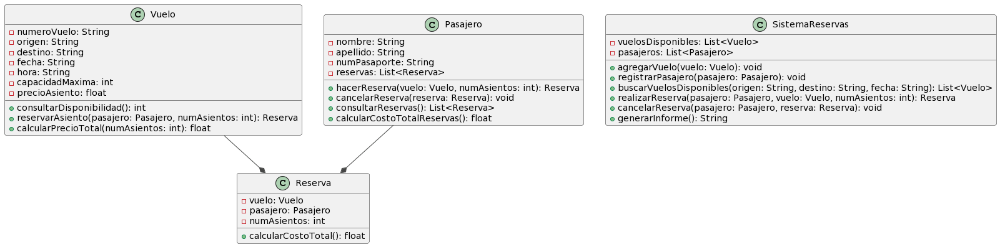

 

# Problema No 1.- Caso Figuras 

## Redaccion del Problema 

Una aerolínea necesita desarrollar un sistema de gestión de vuelos que permita a los pasajeros consultar la disponibilidad de vuelos, reservar asientos en un vuelo y calcular el precio total de una reserva. Para abordar este problema, se requiere una clase Vuelo que represente la información de un vuelo, incluyendo su número, origen, destino, fecha, hora, capacidad máxima de asientos y precio por asiento.

El sistema debe permitir a los pasajeros realizar las siguientes operaciones:

  *  Consultar la disponibilidad de asientos en un vuelo.
  *  Reservar asientos en un vuelo específico.
  *  Calcular el precio total de una reserva en función del número de asientos reservados y el precio por asiento.

La clase Vuelo se ha diseñado para abordar este problema. Proporciona métodos para realizar estas operaciones, incluyendo consultarDisponibilidad(), reservarAsiento(), y calcularPrecioTotal().

El código Java de la clase Vuelo es una parte esencial de la solución, ya que representa la entidad "Vuelo" y proporciona la funcionalidad necesaria para administrar y reservar asientos en los vuelos de la aerolínea.

Por supuesto, este es solo un fragmento del código, y para completar la solución, sería necesario tener clases adicionales, como Pasajero, Reserva, y un SistemaReservas que coordine todas las operaciones. Pero este fragmento se enfoca en la representación y gestión de los vuelos en sí.

---
## Diagrama UML del problema

[Codigo en plantUML](codigoPlantUML.md)

---
## Codigo Java de las Clases
~~~

import java.util.List;
import java.util.ArrayList;

class Vuelo {
    private String numeroVuelo;
    private String origen;
    private String destino;
    private String fecha;
    private String hora;
    private int capacidadMaxima;
    private float precioAsiento;

    public Vuelo(String numeroVuelo, String origen, String destino, String fecha, String hora,
                 int capacidadMaxima, float precioAsiento) {
        this.numeroVuelo = numeroVuelo;
        this.origen = origen;
        this.destino = destino;
        this.fecha = fecha;
        this.hora = hora;
        this.capacidadMaxima = capacidadMaxima;
        this.precioAsiento = precioAsiento;
    }

    public int consultarDisponibilidad() {
        // Implementación para consultar la disponibilidad de asientos
        return 0; // Aquí deberías implementar la lógica real
    }

    public Reserva reservarAsiento(Pasajero pasajero, int numAsientos) {
        // Implementación para reservar asiento
        return null; // Aquí deberías implementar la lógica real
    }

    public float calcularPrecioTotal(int numAsientos) {
        // Implementación para calcular el precio total de la reserva
        return 0.0f; // Aquí deberías implementar la lógica real
    }
}

class Pasajero {
    private String nombre;
    private String apellido;
    private String numPasaporte;
    private List<Reserva> reservas = new ArrayList<>();

    public Pasajero(String nombre, String apellido, String numPasaporte) {
        this.nombre = nombre;
        this.apellido = apellido;
        this.numPasaporte = numPasaporte;
    }

    public Reserva hacerReserva(Vuelo vuelo, int numAsientos) {
        // Implementación para hacer una reserva
        return null; // Aquí deberías implementar la lógica real
    }

    public void cancelarReserva(Reserva reserva) {
        // Implementación para cancelar una reserva
        // Aquí deberías implementar la lógica real
    }

    public List<Reserva> consultarReservas() {
        // Implementación para consultar las reservas activas
        return new ArrayList<>(); // Aquí deberías implementar la lógica real
    }

    public float calcularCostoTotalReservas() {
        // Implementación para calcular el costo total de todas las reservas
        return 0.0f; // Aquí deberías implementar la lógica real
    }
}

class Reserva {
    private Vuelo vuelo;
    private Pasajero pasajero;
    private int numAsientos;

    public Reserva(Vuelo vuelo, Pasajero pasajero, int numAsientos) {
        this.vuelo = vuelo;
        this.pasajero = pasajero;
        this.numAsientos = numAsientos;
    }

    public float calcularCostoTotal() {
        // Implementación para calcular el costo total de la reserva
        return 0.0f; // Aquí deberías implementar la lógica real
    }
}

class SistemaReservas {
    private List<Vuelo> vuelosDisponibles = new ArrayList<>();
    private List<Pasajero> pasajeros = new ArrayList<>();

    public void agregarVuelo(Vuelo vuelo) {
        // Implementación para agregar un vuelo al sistema
        // Aquí deberías implementar la lógica real
    }

    public void registrarPasajero(Pasajero pasajero) {
        // Implementación para registrar un pasajero en el sistema
        // Aquí deberías implementar la lógica real
    }

    public List<Vuelo> buscarVuelosDisponibles(String origen, String destino, String fecha) {
        // Implementación para buscar vuelos disponibles
        return new ArrayList<>(); // Aquí deberías implementar la lógica real
    }

    public Reserva realizarReserva(Pasajero pasajero, Vuelo vuelo, int numAsientos) {
        // Implementación para realizar una reserva
        return null; // Aquí deberías implementar la lógica real
    }

    public void cancelarReserva(Pasajero pasajero, Reserva reserva) {
        // Implementación para cancelar una reserva
        // Aquí deberías implementar la lógica real
    }

    public String generarInforme() {
        // Implementación para generar un informe
        return ""; // Aquí deberías implementar la lógica real
    }
}

public class Main {
    public static void main(String[] args) {
        // Aquí puedes crear instancias de las clases y realizar operaciones según sea necesario
    }
}

~~~
