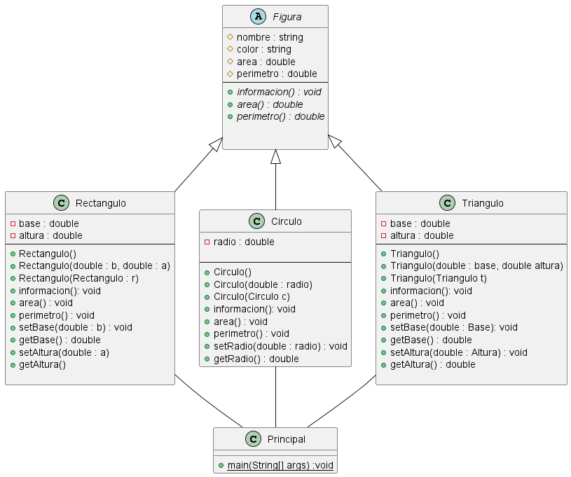

 

# Problema No 1.- Caso Figuras 

## Redaccion del Problema 

El código proporcionado está diseñado para abordar el problema de modelar y calcular las características geométricas (área y perímetro) de diferentes tipos de figuras geométricas, como rectángulos, círculos y triángulos, en un programa Java.

 __Problema:__

Se necesita un programa que pueda representar varias figuras geométricas y calcular sus áreas y perímetros. Cada figura geométrica debe ser una entidad independiente con propiedades específicas, como base, altura y radio. El programa debe proporcionar una forma de:

Representar diferentes tipos de figuras geométricas, como rectángulos, círculos y triángulos.
Calcular el área y el perímetro de cada figura geométrica.
Mostrar información sobre cada figura geométrica.

__Solución:__
Para resolver este problema, se ha utilizado la programación orientada a objetos en Java. Se han definido las siguientes clases:

 __Figura:__ Una clase abstracta que sirve como una interfaz común para todas las figuras geométricas. Define métodos abstractos para calcular el área y el perímetro, así como para mostrar información.

__Rectangulo, Circulo y Triangulo:__ Clases concretas que heredan de la clase Figura. Cada una de estas clases proporciona implementaciones específicas para calcular el área y el perímetro de su forma geométrica correspondiente.

__Principal:__ Una clase principal que demuestra cómo usar las clases de figuras geométricas. Se crean instancias de diferentes figuras geométricas y se calculan sus áreas y perímetros.

Este enfoque permite representar de manera eficiente figuras geométricas, calcular sus características y proporcionar flexibilidad para agregar más tipos de figuras geométricas en el futuro.

Por lo tanto, el problema resuelto es la representación y el cálculo de características geométricas para varias figuras geométricas en Java, utilizando la programación orientada a objetos y abstracción a través de clases e interfaces.

---
## Diagrama UML del problema

[Codigo en plantUML](CodigoUML.md)

---
## Codigo Java de las Clases
~~~
// Clase abstracta Figura
abstract class Figura {
    protected String nombre;
    protected String color;
    protected double area;
    protected double perimetro;

    public abstract void informacion();
    public abstract double calcularArea();
    public abstract double calcularPerimetro();
}

// Clase Rectangulo que hereda de Figura
class Rectangulo extends Figura {
    private double base;
    private double altura;

    public Rectangulo() {
    }

    public Rectangulo(double base, double altura) {
    
    }

    public Rectangulo(Rectangulo r) {
       
    }

    public void informacion() {
      
    }

    public double calcularArea() {
        
    }

    public double calcularPerimetro() {
      
    }

    public void setBase(double base) {
        
    }

    public double getBase() {
     
    }

    public void setAltura(double altura) {
       
    }

    public double getAltura() {
      
    }
}

// Clase Circulo que hereda de Figura
class Circulo extends Figura {
    private double radio;

    public Circulo() {
    }

    public Circulo(double radio) {
    
    }

    public Circulo(Circulo c) {
       
    }

    public void informacion() {
       
    }

    public double calcularArea() {
        
    }

    public double calcularPerimetro() {
       
    }

    public void setRadio(double radio) {
 
    }

    public double getRadio() {
        
    }
}

// Clase Triangulo que hereda de Figura
class Triangulo extends Figura {
    private double base;
    private double altura;

    public Triangulo() {
    }

    public Triangulo(double base, double altura) {
 
    }

    public Triangulo(Triangulo t) {
     
    }

    public void informacion() {
 
    }

    public double calcularArea() {
       
    }

    public double calcularPerimetro() {
   
    }

    public void setBase(double base) {
 
    }

    public double getBase() {

    }

    public void setAltura(double altura) {
   
    }

    public double getAltura() {

    }
}

// Clase Principal
public class Principal {
    public static void main(String[] args) {
        // Ejemplo de uso
        Figura figura1 = new Rectangulo(5.0, 4.0);
        Figura figura2 = new Circulo(3.0);
        Figura figura3 = new Triangulo(6.0, 2.0);

        figura1.informacion();
        System.out.println("Área: " + figura1.calcularArea());
        System.out.println("Perímetro: " + figura1.calcularPerimetro());

        figura2.informacion();
        System.out.println("Área: " + figura2.calcularArea());
        System.out.println("Perímetro: " + figura2.calcularPerimetro());

        figura3.informacion();
        System.out.println("Área: " + figura3.calcularArea());
        System.out.println("Perímetro: " + figura3.calcularPerimetro());
    }
}

~~~
